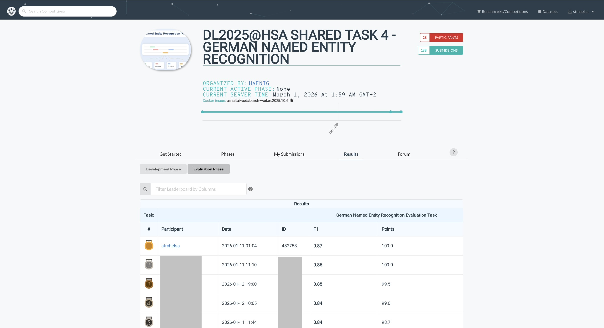

# 🇩🇪 German Named Entity Recognition (Task 4)
### Frozen Transformer + BiLSTM + CRF

---

## 🏆 Competition Achievement

| Metric | Value |
|--------|--------|
| Final Macro-F1 | **0.87** |
| Reference Range | ~0.85 |
| Participants | 28 |
| Score | 100 / 100 |

📌 The model achieved performance above the 85% reference level and obtained the maximum score.



---

## 🎯 Task Description

The goal of this task is to build a neural network for **German Named Entity Recognition (NER)**.

The system must identify the following entity types:

- **PER** – Person  
- **ORG** – Organization  
- **LOC** – Location  

Participants are allowed to use pretrained language models (up to 1B parameters) as a backbone.  
However, these models **must not be fine-tuned for NER**.

---

## 📏 Evaluation Metric

Performance is evaluated using **F1-Score**, computed separately for:

- F1_PER
- F1_ORG
- F1_LOC

Final score:

\[
Macro-F1 = (F1_{PER} + F1_{ORG} + F1_{LOC}) / 3
\]

Reference systems achieve around **85% F1**.

### ✅ Final Result

```
Macro-F1 = 0.87
```

The model performs above the reference range.

---

## 🏗 System Design

This solution follows a **Frozen Transformer + Trainable Sequence Head** architecture.

Design philosophy:

- Use a strong pretrained German encoder for contextual representations.
- Keep encoder frozen to comply with task rules.
- Train a structured prediction head on top.
- Use CRF for sequence-level consistency.

---

## 🧠 Model Architecture

### 1️⃣ Frozen Backbone

- Model: `deepset/gelectra-large`
- Hidden size: 1024
- Last 4 hidden layers concatenated → 4096-dim representation
- Backbone parameters remain frozen

Total encoder parameters: ~334M

---

### 2️⃣ Trainable NER Head

Pipeline:

```
Frozen Transformer Output
        ↓
Last 4 Layers Concatenation (4096)
        ↓
Linear(4096 → 512) + GELU + Dropout(0.5)
        ↓
BiLSTM (hidden=256, bidirectional)
        ↓
Linear → 7 BIO tags
        ↓
CRF (sequence decoding)
```

Trainable head parameters: ~3.6M  
Total parameters: ~338M (within 1B constraint)

---

## 🔄 Data Processing

- Input format: TSV files
- Sentence boundaries detected by empty lines
- Non-target entity types mapped to `O`
- Labels used:
  - `O`
  - `B/I-PER`
  - `B/I-ORG`
  - `B/I-LOC`

Word alignment strategy:
- Only first subword of each word contributes to word-level prediction.

---

## ⚙️ Training Configuration

| Component | Value |
|------------|---------|
| Max sequence length | 128 |
| Train batch size | 8 |
| Validation batch size | 16 |
| Epochs | 10 |
| Optimizer | AdamW |
| Learning rate | 3e-4 |
| Weight decay | 0.01 |
| Scheduler | OneCycleLR |
| Dropout | 0.5 |

Loss configuration:
- CRF loss (primary)
- Weighted CE scaffolding available

---

## 📊 Validation Performance (Notebook Run)

| Metric | Score |
|---|---:|
| Macro-F1 | **0.9006** |
| PER F1 | 0.9549 |
| ORG F1 | 0.8212 |
| LOC F1 | 0.9257 |

Competition Evaluation:

```
Macro-F1 = 0.87
```

The slight drop indicates realistic generalization to hidden test data.

---

## 📦 Submission Compliance

- Pretrained model not fine-tuned for NER
- Total parameters < 1B
- Individual submission
- Reproducible GitLab project provided
- Submission package validated via dynamic import test
- ZIP size: ~603MB

---

## 📂 Repository Structure

```
task-4/
├── task_4.ipynb
├── model.py
├── requirements.txt
├── public_data-4/
├── submission/
│   ├── model.py
│   └── weights/
├── best_head_weighted.pt
└── submission.zip
```

---

## 🚀 Reproducibility

```
python -m venv .venv
source .venv/bin/activate
pip install -r requirements.txt
pip install torchcrf
```

Run:

```
jupyter notebook task_4.ipynb
```

Notebook exports:

- Encoder weights
- NER head weights
- Submission package

---

## 🧩 Engineering Highlights

- Frozen large-scale transformer feature extractor
- Multi-layer feature fusion
- BiLSTM sequence modeling
- CRF decoding for structured output
- Data augmentation via entity swapping
- Controlled regularization

---

## 🔍 Key Insights

- Freezing a large encoder still yields strong NER performance.
- CRF improves boundary consistency in BIO tagging.
- ORG entities remain the hardest class (lower F1 than PER/LOC).
- Layer concatenation significantly boosts representation quality.

---

## 👤 Author

Mohamed Elsayed
M.Sc. Data Science  
